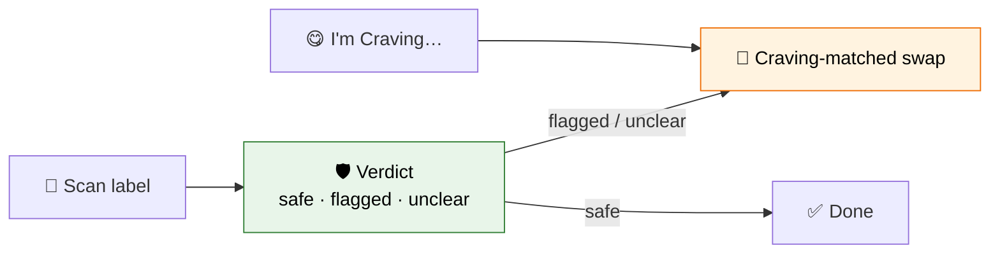
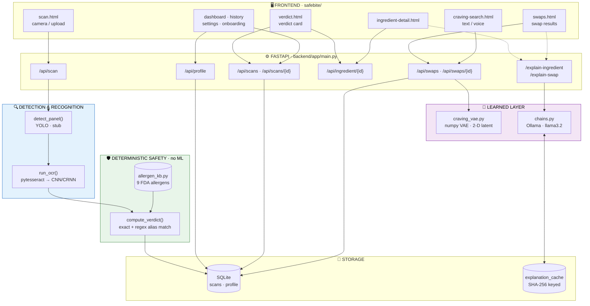
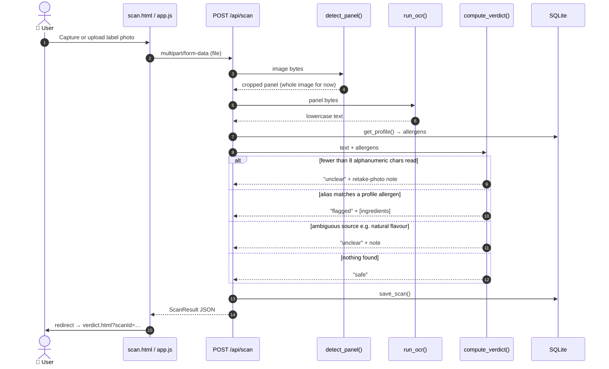
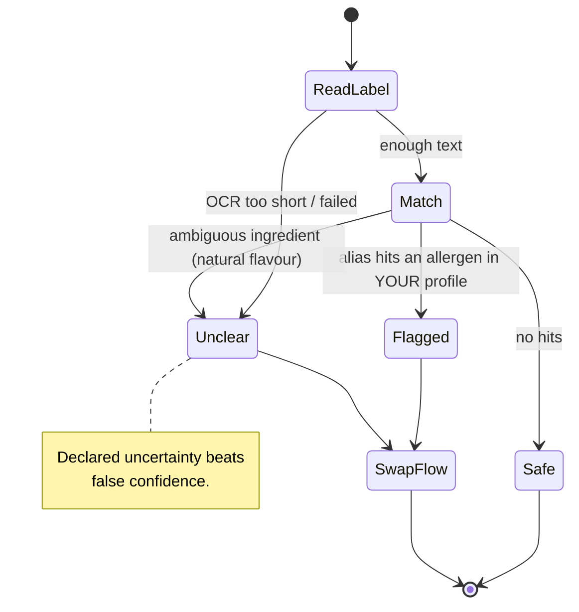
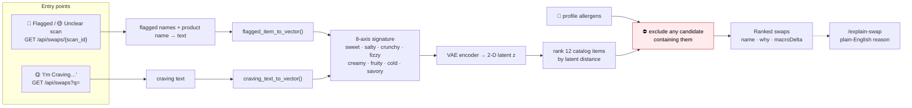
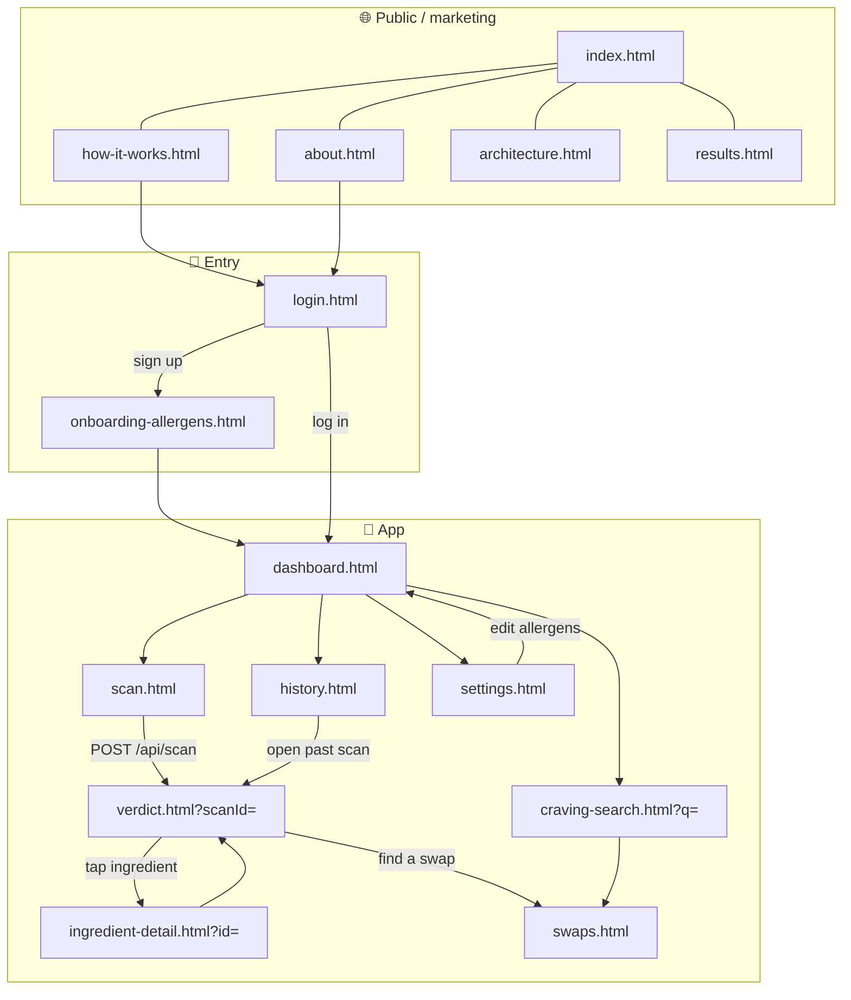
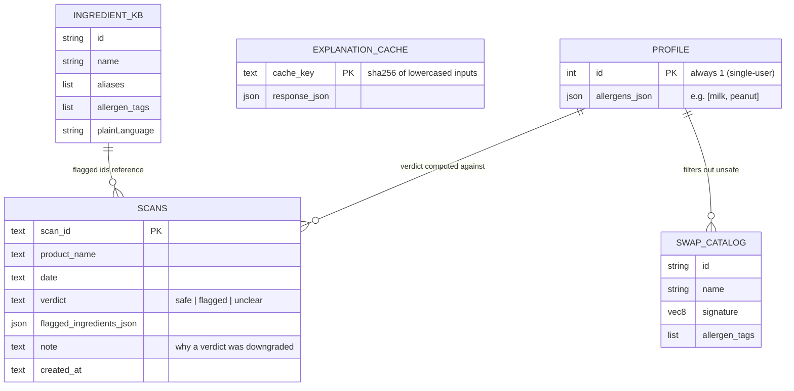
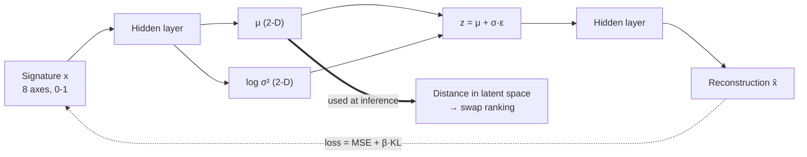

<div align="center">

# 🥗 SafeBite-DL

### Scan the label. Get an honest verdict. Get a swap that actually matches your craving.

*Reading a label shouldn't require a chemistry degree.*


**[▶ Quick start](#-quick-start)** · **[🗺️ Flows](#%EF%B8%8F-the-flows)** · **[🔌 API](#-api-map)** · **[🧠 Models](#-model-zoo)** · **[✅ What's real](#-whats-real-vs-planned)**

</div>

---

## 💡 The idea in 30 seconds

| 🛡️ The Safety Problem | 🍟 The Craving Problem |
|---|---|
| Allergens hide behind scientific names, E-numbers and *"natural flavouring."* Most scanners answer with **false confidence**. | When a food is off-limits, the usual advice is a generic "healthier swap" that ignores **why** you wanted it: the crunch, the salt, the ritual. |
| SafeBite says **safe / flagged / unclear**, and defaults to *unclear* when it can't read the label. | SafeBite matches swaps on **texture, flavour and mouth-feel**, never on an allergen you have. |



---

## 🗺️ The Flows

> Click any block below to expand it. Every diagram renders natively on GitHub.

<details open>
<summary><b>1️⃣ System architecture: how all the pieces connect</b></summary>

<br>



**Five layers, one pipeline:** Frontend → Detection & Recognition → **Deterministic Safety** → Learned Recommendation → Generation.

</details>

<details>
<summary><b>2️⃣ The Scan Journey: photo to verdict (sequence)</b></summary>

<br>



</details>

<details>
<summary><b>3️⃣ The Verdict Engine: three states, one rule (never guess "safe")</b></summary>

<br>



| State | Meaning | UI |
|---|---|---|
| 🟢 **safe** | Label read fine and nothing matched your profile | Done, no swap needed |
| 🔴 **flagged** | An ingredient alias matched an allergen you declared | Shows the flagged ingredients + swaps |
| 🟡 **unclear** | Couldn't read enough text, or the ingredient's source is unknowable | Retake photo / double-check + swaps |

</details>

<details>
<summary><b>4️⃣ The Craving Journey: two entry points, one engine</b></summary>

<br>



> 🔒 **A craving match can never be an unsafe swap.** Allergen filtering happens *after* ranking and is not learned.

</details>

<details>
<summary><b>5️⃣ Frontend page map: every screen and where it leads</b></summary>

<br>



</details>

<details>
<summary><b>6️⃣ Data model & how the pieces share data</b></summary>

<br>



`INGREDIENT_KB` and `SWAP_CATALOG` live in code (small, fixed vocabulary). Only scans and the profile need persistence.

</details>

---

## ✨ Features

<details open>
<summary><b>🛡️ Safety</b></summary>

- **Three-state verdict**: safe / flagged / unclear, deterministic and auditable
- **9 FDA major allergens** covered: milk, egg, fish, shellfish, tree nut, peanut, wheat, soy, sesame
- **Alias-aware matching**: `casein`, `whey`, `ghee`, `caseinate` all resolve to *Milk*
- **Word-boundary regex**, so "oat" doesn't match "coat"
- **Fail-safe OCR gate**: unreadable labels return *unclear*, never *safe*
- **Personal profile**: verdicts are computed against *your* allergens only

</details>

<details>
<summary><b>📸 Scanning</b></summary>

- Camera capture / photo upload on `scan.html`
- YOLO-based ingredient-panel detector (architected, stubbed today)
- OCR via pytesseract now, CNN/CRNN model planned
- Scan history persisted in SQLite and browsable on `history.html`
- Product name attached to each scan

</details>

<details>
<summary><b>🔁 Craving-matched swaps</b></summary>

- **8-axis craving signature** (sweet, salty, crunchy, fizzy, creamy, fruity, cold, savory)
- **VAE latent-space ranking** replaces the old tag-overlap formula
- **Two entry points**: from a flagged scan, or straight from "I'm craving…"
- **Allergen-safe by construction**: candidates with your allergens are removed
- Each swap carries a `macroDelta` (e.g. *"+8g protein, gluten-free"*) and a one-line *why*

</details>

<details>
<summary><b>💬 Explanations</b></summary>

- **Ingredient explainer**: one plain-English sentence, deliberately forbidden from judging safety
- **Swap explainer**: why this swap matches this craving, for both entry points
- **Persistent cache**: same question, same answer, no repeat LLM call
- **Graceful degradation**: if Ollama is down, only the two `/explain-*` routes return `503`; scanning, verdicts and swaps keep working

</details>

<details>
<summary><b>🧰 Engineering</b></summary>

- CORS restricted to a dev allow-list (override with `ALLOWED_ORIGINS`)
- Startup Ollama health check with an explicit, actionable warning
- Pydantic schemas with entry-point validation
- Structured logging, custom exception handlers with clean JSON errors
- Demo scans auto-seeded on first run
- `pytest` suite for chains, output parser, schemas, routes and the scan flow

</details>

---

## 🧠 Model Zoo

Each model is tied to a taught module, and each is benchmarked against the non-learned thing it replaces.

| Model | Module | Replaces | Status |
|---|:---:|---|:---:|
| **Craving VAE** (numpy: encoder, reparameterisation, decoder, recon + KL loss) | M6 | Hand-weighted tag overlap | ✅ Trained |
| **LLM explainer** (Ollama `llama3.2` via LangChain) | · | Prompted cloud-LLM calls | ✅ Running |
| **Label OCR** (CNN/CRNN + BiLSTM + CTC) | M3 | Tesseract | 🔧 Planned, pytesseract placeholder |
| **Panel detector** (YOLOv8) | M5 | Manual cropping | 🔧 Planned, stub |
| **Attention captioner + LSTM decoder** | M4 / M5 | Prompted explanations | 🔧 Planned |
| **Scan-history BiLSTM** | M4 | Nothing (new proactive nudge) | 🔧 Planned |
| **Conditional GAN** (label-image augmentation) | M6 | Small dataset | 🔧 Planned |
| **MLP baseline** (SGD vs Adam vs RMSProp) | M1 / M2 | Required from-scratch reference | 🔧 Planned |

<details>
<summary><b>🔬 How the Craving VAE works</b></summary>

<br>



Trained for 4000 full-batch epochs (lr 0.05, β 0.1) in under a second. No PyTorch or TensorFlow dependency.

> ⚠️ **Honesty note:** the catalog is 12 hand-authored items. Ranking quality is *illustrative of the technique*, not a validated recommender.

</details>

---

## 🔒 The One Thing We Deliberately Did *Not* Learn

The safety verdict is **fully deterministic**. That is the most defensible decision in the project.

| | Deterministic keyword engine | Learned classifier |
|---|:---:|:---:|
| **Auditable line by line** | ✅ | ❌ |
| **Guaranteed to default to "unclear"** | ✅ | ⚠️ needs calibration |
| **Predictable failure** | ✅ | ❌ |
| **Cost of a wrong "safe"** | someone's health | someone's health |

A wrong *safe* is categorically worse than a mediocre OCR read or an imperfect swap, so the highest-stakes decision is kept the simplest and most inspectable. Knowing where **not** to apply deep learning is part of the engineering contribution.

---

## 🔌 API Map

Interactive docs live at **`http://localhost:8000/docs`** once the server is running.

| Method | Endpoint | Purpose | Consumed by |
|:---:|---|---|---|
| `POST` | `/api/scan` | Upload label photo → verdict | `scan.html` |
| `GET` | `/api/scans` | Scan history, newest first | `dashboard.html`, `history.html` |
| `GET` | `/api/scans/{id}` | One scan | `verdict.html` |
| `GET` | `/api/ingredient/{id}` | Ingredient details + aliases | `ingredient-detail.html` |
| `GET` | `/api/profile` | Current allergen profile | `settings.html` |
| `POST` | `/api/profile` | Save allergen profile | `onboarding-allergens.html`, `settings.html` |
| `GET` | `/api/swaps/{scan_id}` | Swaps for a flagged/unclear scan | `swaps.html` |
| `GET` | `/api/swaps?q=` | Swaps for a typed craving | `craving-search.html` |
| `POST` | `/explain-ingredient` | One-sentence ingredient explanation | `ingredient-detail.html` |
| `POST` | `/explain-swap` | Why a swap fits (`scan` or `craving`) | `swaps.html` |
| `GET` | `/health` | Liveness check | ops |

<details>
<summary><b>📦 Example payloads</b></summary>

<br>

**`POST /api/scan` → `ScanResult`**
```json
{
  "scanId": "a1b2c3d4",
  "productName": "Scanned Product",
  "date": "today",
  "verdict": "flagged",
  "flaggedIngredients": [{ "id": "milk", "name": "Milk / Dairy" }],
  "note": null
}
```

**`GET /api/swaps?q=salty crunchy`**
```json
{
  "query": "salty crunchy",
  "results": [
    { "id": "sw3", "name": "Roasted Chickpeas",
      "macroDelta": "+4g protein, nut-free",
      "why": "Same salty crunch as peanuts, without the allergen." }
  ]
}
```

**`POST /explain-swap`**
```json
{
  "entry_point": "craving",
  "craving_query": "salty crunchy",
  "recommended_food": "Roasted Chickpeas"
}
```
`entry_point: "scan"` requires `original_food` instead of `craving_query`.

</details>

---

## 🗂️ Project Structure

```text
safebite/
├── safebite/                    # 🖥️ Frontend (static, no build step)
│   ├── index · about · how-it-works · architecture · results   # public pages
│   ├── login · onboarding-allergens                            # entry
│   ├── dashboard · scan · verdict · swaps                      # core loop
│   ├── craving-search · ingredient-detail · history · settings
│   ├── app.js                   # API calls + page logic  (API_BASE = localhost:8000)
│   ├── app-data.js              # mock data, same shapes as the API
│   └── assets/                  # Appy mascot sprites, cursor bee, footer art
│
└── backend/
    ├── app/
    │   ├── main.py              # routes, OCR, detector stub, verdict engine
    │   ├── api/explain_routes.py
    │   ├── ai/
    │   │   ├── craving_vae.py   # 🧠 trained VAE + swap catalog
    │   │   ├── chains.py        # LangChain explain chains
    │   │   ├── prompts.py       # strict, safety-neutral prompts
    │   │   ├── output_parser.py
    │   │   └── llm.py           # Ollama client
    │   ├── data/allergen_kb.py  # 9-allergen ingredient KB
    │   ├── cache/explanation_cache.py
    │   ├── schemas/explain.py
    │   └── core/                # config · database · exceptions · logging
    ├── tests/                   # ai · api · schemas
    └── requirements.txt
```

---

## 🚀 Quick Start

<details open>
<summary><b>Backend</b></summary>

```bash
cd backend
python -m venv venv && source venv/bin/activate      # Windows: venv\Scripts\activate
pip install -r requirements.txt

# OCR engine
#   macOS:  brew install tesseract
#   Ubuntu: sudo apt install tesseract-ocr
#   Windows: install Tesseract, or set TESSERACT_CMD

uvicorn app.main:app --reload --host 0.0.0.0 --port 8000
```

Open **http://localhost:8000/docs**.

</details>

<details>
<summary><b>Explanations (optional, needs Ollama)</b></summary>

```bash
# install from https://ollama.com, then:
ollama pull llama3.2
```

Skip this and everything still works except `/explain-ingredient` and `/explain-swap`, which return a clean `503`.

</details>

<details>
<summary><b>Frontend</b></summary>

```bash
cd safebite
python -m http.server 5500      # or VS Code Live Server
```

Open **http://localhost:5500**. Allowed dev ports: `3000`, `5173`, `5500`, `8080`.

</details>

<details>
<summary><b>Tests</b></summary>

```bash
cd backend
pytest
```

</details>

<details>
<summary><b>⚙️ Environment variables</b></summary>

| Variable | Default | Purpose |
|---|---|---|
| `ALLOWED_ORIGINS` | localhost dev ports | Comma-separated CORS allow-list |
| `OLLAMA_BASE_URL` | `http://localhost:11434` | Where Ollama runs |
| `OLLAMA_MODEL` | `llama3.2` | Model for explanations |
| `TESSERACT_CMD` | auto | Path to `tesseract` binary (Windows) |

</details>

---

## ✅ What's Real vs Planned

| Piece | Status |
|---|:---:|
| Scan → verdict → swap loop, end to end | ✅ Working |
| Deterministic verdict engine + OCR safety gate | ✅ Working |
| 9-allergen knowledge base | ✅ Working |
| Craving VAE ranking with allergen exclusion | ✅ Trained |
| LLM explanations + persistent cache | ✅ Working (needs Ollama) |
| SQLite persistence for scans & profile | ✅ Working |
| Custom CNN/CRNN OCR | 🔧 pytesseract placeholder |
| YOLO panel detector | 🔧 `detect_panel()` returns the whole image |
| Attention captioner / LSTM decoder | 🔧 Not built |
| Scan-history BiLSTM nudges | 🔧 Not built |
| Conditional GAN augmentation | 🔧 Not built |
| Real multi-user auth | 🔧 Single shared profile today |

> Where a learned model doesn't beat its baseline at this dataset scale, **we report that plainly.** An honest null result beats an inflated claim.

---

## 🧭 Roadmap

```mermaid
gantt
    title 10-week plan
    dateFormat  X
    axisFormat  Wk %s
    section Foundation
    Deterministic scan→verdict fallback   :done, 0, 2
    M1/M2 baseline + dataset collection   :active, 0, 2
    section Vision
    YOLO detector + CNN/CRNN OCR          :2, 5
    GAN augmentation                      :3, 5
    section Language & Recommendation
    VAE embeddings                        :done, 5, 8
    Explanation generators + BiLSTM       :5, 8
    section Wrap-up
    Integration, evaluation, report, demo :8, 10
```



---

## ⚠️ Risk Register

| Risk | Mitigation |
|---|---|
| Small label-image dataset | Pretrain on public OCR corpora, augment with GAN, report honestly |
| Annotation is slow | Cap at 150–250 images, quality over volume |
| VAE swaps feel "off" | Structured taste-test with team and outside testers |
| Generated text hallucinates | Grounding check; discard ungrounded output |
| No real scan-history data | Synthetic, explicitly disclosed as simulated |
| Six models, one semester | Deterministic flow stays a working fallback at every stage |

---

## 🥊 Where SafeBite Sits

Fig, Yuka, IngrediCheck and Subfy already do personalised matching, barcode scanning and alias tracking well. **We don't claim to out-compete them there.**

What none of them do is ground a substitution in **structured sensory attributes** (texture, mouth-ritual, flavour, format) instead of treating taste as a simple filter. That is the one hypothesis this project tests, honestly.

---

## 📚 References

Open Food Facts · USDA FoodData Central · FDA FALCPA · FARE · EU FIC Regulation · YOLOv8 (Ultralytics) · CS Girlies Annual Hackathon (original SafeBite spec)

---

<div align="center">

### Built by

**Dharmi · Jasmine · Rajasree**

*CSE4006 Deep Learning · VIT-AP University*

</div>
